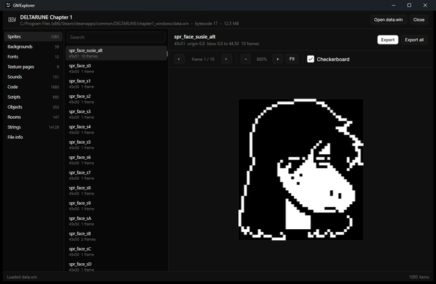

<div align="center">


# GMExplorer

**Drop a GameMaker game onto the window and read everything inside it.**

Sprites, texture pages, sounds, rooms, objects — and the code, decompiled back to GML.

</div>

<div align="center">
  
</div>

---

## What it does

Drop the game's **`.exe`** on the window. GMExplorer finds the data archive next to it — or inside
it, for single-file builds — and brings the rest of the game with it: audio groups, FMOD banks,
DLLs and anything baked into the executable's resources. Dropping a `data.win` directly works too.

| | |
|---|---|
| **Sprites, backgrounds, fonts** | every frame, with origin and bounding box, on a checkerboard; zoom to 3200% with crisp nearest-neighbour scaling |
| **Texture pages** | the raw atlases, including the QOI + BZip2 pages GameMaker 2022.3+ uses |
| **Sounds** | embedded audio, external `audiogroup*.dat`, **and the samples inside FMOD `.bank` files** — all playable in place |
| **Code** | decompiled GML with `if`/`else`, loops, `switch`, `with`, short-circuit operators and function definitions, plus the raw disassembly next to it |
| **Native code** | for games compiled with the YoYo Compiler, which have no bytecode at all |
| **Objects and rooms** | parents, sprites, event lists that jump straight to the code, instance layouts |
| **Game files** | every file that ships with the game, plus the executable's embedded resources |

Everything is exportable: single items, or a whole category at once — sprites as PNG, sounds as
WAV/OGG, code as `.gml`.

## Supported games

| | |
|---|---|
| Archives | `data.win`, `.unx`, `.ios`, `.droid`, or embedded in the executable |
| Bytecode | 14 through 17 (GameMaker Studio 1 through GameMaker 2024) |
| Textures | PNG, QOI, and BZip2-compressed QOI |
| Audio | WAV / OGG / MP3 in the archive, external audio groups, FMOD Studio banks |
| Executables | x86 and x86-64 |

Read-only by design: GMExplorer never writes to the game.

## Building

Needs the [.NET 9 SDK](https://dotnet.microsoft.com/download). The app alone:

```bash
dotnet build GMExplorer/GMExplorer.csproj -c Release
```

The whole solution, including the native analyser, needs Visual Studio 2022 with the C++ tools:

```bash
msbuild GMExplorer.sln -p:Configuration=Release
```

### The native analyser (optional)

`native/gmnative.vcxproj` builds `gmnative.dll`, which reads the machine code of YYC games. It
depends on [Zydis](https://github.com/zyantific/zydis) — the amalgamated `Zydis.c` and `Zydis.h`,
which live in `native/extern/Zydis/`. Point the build at a copy elsewhere with either:

```bash
msbuild native\gmnative.vcxproj -p:Configuration=Release -p:Platform=x64 -p:ZydisDir=C:\path\to\Zydis
```

or a `ZYDIS_DIR` environment variable. The app copies the DLL into its output automatically and
runs fine without it — the *Native code* tab just explains that it is missing.

### Headless self-check

```bash
GMExplorer.exe --dump path\to\data.win report.txt [codeEntryName ...]
```

Parses the archive, decodes every code entry, decompiles all of them and writes a report with
counts, timings and any parse warnings. Handy after touching the format layer.

## How some of it works

**Decompiling.** GameMaker's VM is a stack machine, so the decompiler simulates the stack to
rebuild expressions, then matches the branch shapes its compiler emits: `if`/`else`, `while`,
`do`/`until`, `with`, `switch` chains, and the jump patterns behind `&&`, `||` and `?:`. GMS 2.3
function definitions are unfolded, so `foo = method(self, gml_Script_foo)` is shown as
`function foo() { … }` with the body inline. Anything that does not match a known shape degrades
to labels and `goto` rather than being dropped, and the disassembly is always one click away.

**Textures.** GameMaker 2022.3+ stores atlases as QOI — the original 2021 draft of the format, not
the released spec — wrapped in BZip2, with the channels in BGRA order. Both are decoded here.

**YYC games.** These ship native code instead of bytecode, but the runtime still needs the GML
names, so the binary carries a table of `{ const char *name, void *code }` records. gmnative finds
that table by majority vote on the pointer layout (which works across 32- and 64-bit builds and the
different record shapes YYC emits), recovers function boundaries from call targets and the
exception directory, then disassembles with Zydis, resolving calls, strings and imports back to
names. On one 12 MB game that recovers **2,536 named GML functions in 2.4 s**.

**FMOD banks.** FSB5 samples are Vorbis with the codec headers stripped out, which is why most
extractors can only dump raw blobs. GMExplorer instead loads the **game's own `fmod.dll`**, runs it
with its output set to `NOSOUND`, and reads the decoded PCM back — so bank music and sound effects
play and export like any other sound.

## Limitations

- The decompiler is a best-effort reconstruction, not a compiler round-trip. On DELTARUNE Chapter 1
  it decompiles all 1,680 code entries with no failures; about 3% end with values left on the stack
  and 11% contain a `goto` where a control-flow shape was not recognised. Both are flagged in the
  output.
- YYC games give you *named machine code*, not GML. You can see which function is `scr_getinput`,
  what it calls and which constants it uses — that is as far as it goes.
- FMOD bank samples need the game's own fmod library present. Without it the samples are still
  listed with names, codec, channels, rate and length; they just cannot be played.
- Sprites of type SWF or Spine are listed but not rendered.

## Layout

```
GMExplorer/
  Gm/                  format layer, no UI
    GmData.cs          chunk parsing: sprites, sounds, code, objects, rooms
    Bytecode.cs        VM instruction decoder and disassembler
    Decompiler.cs      bytecode -> GML
    Textures.cs        QOI + BZip2 decoding, PNG writing
    Bank.cs            FMOD bank / FSB5 reader
    Fmod.cs            decoding through the game's own fmod library
    PeFile.cs          PE resources and appended data
    GamePackage.cs     discovers everything shipping with a game
    NativeCode.cs      wrapper around gmnative.dll
  Ui/                  audio playback, texture-page cache
  MainWindow.axaml     the whole interface
native/
  gmnative.vcxproj     x64 DLL: PE analysis + Zydis disassembly
  extern/Zydis/        external dependency, see above
```

## Built with

[Avalonia](https://avaloniaui.net) · [Zydis](https://github.com/zyantific/zydis) ·
[NAudio](https://github.com/naudio/NAudio) · [NVorbis](https://github.com/NVorbis/NVorbis) ·
[SharpZipLib](https://github.com/icsharpcode/SharpZipLib)

## Licence

[MIT](LICENSE). Every dependency is MIT too; their notices are collected in
[THIRD-PARTY-NOTICES.md](THIRD-PARTY-NOTICES.md).

FMOD is not bundled — bank decoding uses the fmod library that ships with the game being inspected.

Made for looking at your own games and at games you have a right to inspect.
